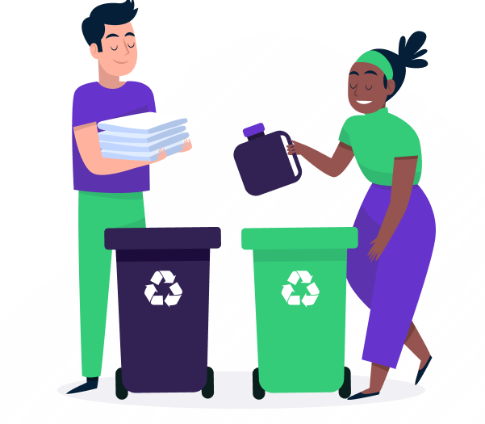
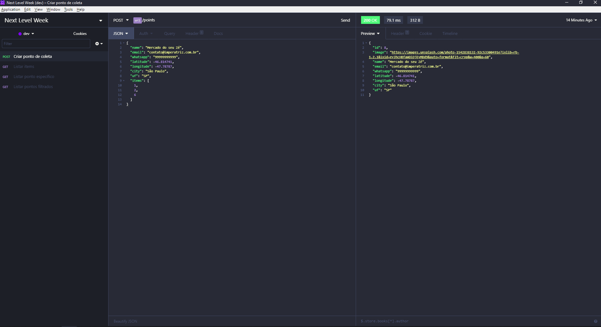

<h1 align="center">
    
</h1>

<p align="center">
  

  
  
  <a href="https://github.com/raphabarreto/ecoleta/commits/master">
    
  </a>

  <a href="https://github.com/raphabarreto/ecoleta/issues">
    
  </a>

  <a href="https://github.com/raphabarreto/ecoleta/blob/master/LICENSE.md">
    
  <a>
</p>

<p align="center">
  <a href="#rocket-tecnologias">Tecnologias</a>&nbsp;&nbsp;&nbsp;|&nbsp;&nbsp;&nbsp;
  <a href="#-projeto">Projeto</a>&nbsp;&nbsp;&nbsp;|&nbsp;&nbsp;&nbsp;
  <a href="#-backend">Backend</a>&nbsp;&nbsp;&nbsp;|&nbsp;&nbsp;&nbsp;
  <a href="#-frontend">Frontend</a>&nbsp;&nbsp;&nbsp;|&nbsp;&nbsp;&nbsp;
  <a href="#-mobile">Mobile</a>&nbsp;&nbsp;&nbsp;|&nbsp;&nbsp;&nbsp;
  <a href="#-como-executar-o-projeto">Instalação</a>&nbsp;&nbsp;&nbsp;|&nbsp;&nbsp;&nbsp;
  <a href="#-instalação">Como contribuir</a>&nbsp;&nbsp;&nbsp;|&nbsp;&nbsp;&nbsp;
  <a href="#memo-licença">Licença</a>
</p>

<br>


---

## 🚀 Tecnologias

Esse projeto foi desenvolvido com as seguintes tecnologias:

- [Node.js](https://nodejs.org/en/)
- [React](https://reactjs.org)
- [React Native](https://facebook.github.io/react-native/)
- [Expo](https://expo.io/)
<!-- - [Jest](https://jestjs.io/)
- [Celebrate](https://github.com/arb/celebrate) -->

## 💻 Projeto
Projeto desenvolvido durante a <strong>Next Level Week</strong> que tem como objetivo fins ecológicos. 
O <strong>Ecoleta</strong> serve como um Marketplace, uma conexão entre empresas ou entidade que coletam resíduos, sejam eles orgânicos ou inorgânicos, à pessoas que precisam fazer descarte dos resíduos.

## 🔨 Backend
<h1 align="center">
<a href="https://insomnia.rest/run/?label=Ecoleta&uri=https%3A%2F%2Fraw.githubusercontent.com%2Fraphabarreto%2Fecoleta%2Fmaster%2Fserver%2FEcoleta.json" target="_blank"></a>
</h1>

## 🌐 Frontend
<h1 align="center">
    
</h1>

## 📱 Mobile
<h1 align="center">
    <!--  -->
    <strong>Ainda em construção</strong>
</h1>

## 🔥 Instalação

```bash
$ git clone git@github.com:raphabarreto/ecoleta.git
$ Navegue até a pasta server e execute o comando:
$ yarn dev:server
$ Depois disso, entre na pasta web e execute o comando:
$ yarn start
```


## 🤔 Como contribuir

- Faça um fork desse repositório;
- Cria uma branch com a sua feature: `git checkout -b minha-feature`;
- Faça commit das suas alterações: `git commit -m 'feat: Minha nova feature'`;
- Faça push para a sua branch: `git push origin minha-feature`.

Depois que o merge da sua pull request for feito, você pode deletar a sua branch.


## 🧾 Licença

Esse projeto está sob a licença MIT. Veja o arquivo [LICENSE](LICENSE.md) para mais detalhes.

---

Feito com 💗 by [Raphael Barreto](https://bit.ly/contato-linkedin)